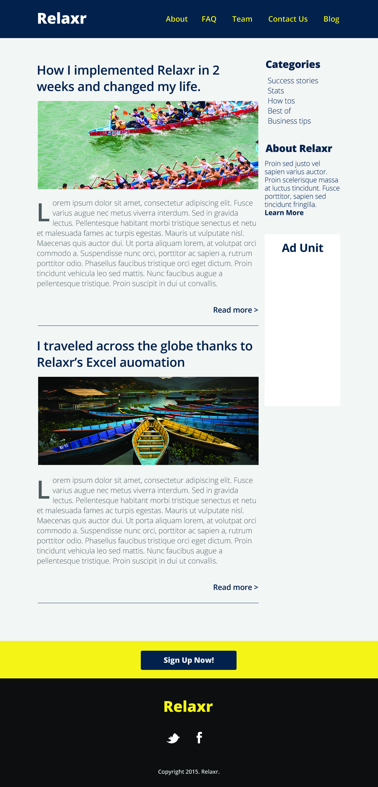

###Description

This week we will be expanding on the Relaxr landing page that we created last week. We will be creating the 'Blog' portion of the site. For this assignment feel free to be creative. You can change the content and styling to something that interests you. As long as you meet the [technical requirements](#requirements) you may get as creative as you'd like! Happy coding :)




<br>

---


###Real-World Applications

- Build websites with multi-column layouts
- Turn complex design assets into code
- Style text on your page with Google Fonts

<br>

---

<a name="requirements"></a>

###Technical Requirements

- Use inline-block or floats in your CSS to achieve a two-column layout
- Use the correct ```Open Sans``` Google Font typeface to style the text denoted in the [design file](starter_code/readme) and according to the JPEG provided (you do not need to use Open Sans if you are choosing to customize the site, but you must use a Google Font)
- Use proper filename conventions (lowercase, .html)
- Use a single external CSS stylesheet to style all pages
- Use a `` tag for the headers of the blog posts
- Add a hover effect to all the links using pseudo-classes
- Integrate drop caps using pseudo-classes


#### Bonus
- Link the "Blog" link in the header to the page you've built for this assignment
- Link the "About" link in the header to the [landing page](../../Week_02_Styling/Assignment/starter_code/images/relaxr_landing.jpg) you built last week
- Up for a real challenge? Use ```<script>``` tags in your HTML and [read ahead](https://learn.jquery.com/events/event-basics/) to make a dialogue box pop up when a user clicks "Sign Up Now!" that reads "We're Not Ready For Sign-Ups...Yet."

<br>

---

###Resources

- [Starter Code and Design File](starter_code/design.txt)
- [Documentation on integrating Drop Caps](https://css-tricks.com/snippets/css/drop-caps/)
- [Documentation on CSS Pseudo-classes](http://www.w3schools.com/CSS/CSS_pseudo_classes.asp)
- [Starter Code, Assets, and Design File](starter_code/)
- [Prepare for JavaScript/jQuery](https://generalassemb.ly/online/videos/what-can-you-do-with-javascript)
- [Read ahead on jQuery basics](https://learn.jquery.com/events/event-basics/)

<br>

---

###Evaluation / Submission

Please use the same folder and repository that you used for your landing page assignment.  One point of this assignment is to practice building, and expanding upon your past work.

When ready for evaluation, please push your code to that repository.   I will evaluate against the solution code and your use of technical elements.

I will provide a numeric grade on a scale: does not meet expectations (0); meets expectations (1); exceeds expectations (2). The maximum possible score on this assignment is 14/14.  

Bonus materials are completely optional.
